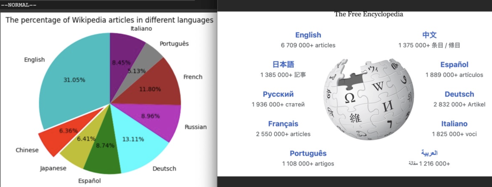

public:: true

- ## 最简单的答案
	- 下载"多邻国"，这个软件设计了一套类似抖音，小红书一般上瘾系统，每天玩10-15分钟。
	  
	  本身软件就是免费的，付费版是为了去掉广告。
	  ---
	  **ChatGPT** 目前最火的AI，成为你的24小时学习助手和心灵导师
		- [链接1](https://blalayu.zeabur.app/)
		- [链接2](https://chat-cf.aizs.eu.org/#/auth ) 这个网页需要输入密码6688
			- 最好用手机自带浏览器，微信或者QQ直接打开可能会有问题。
		- [自己注册ChatGPT的教程](https://mp.weixin.qq.com/s/FkEbpdRfv6DtG0huMQtTIQ)
- ## 更多后续问题
	- ==有的链接需要翻墙才能打开==
	- 了解“多邻国”设计初衷，里面谈到了许多关于学习语言的趣闻
		- [【TED演讲】多邻国创始人|如何让学习像社交媒体一样令人上瘾？_哔哩哔哩_bilibili](https://www.bilibili.com/video/BV1WM411X7vb/)
	- 使用双语插件
		- [youtube开启双语字幕](https://chrome.google.com/webstore/detail/youtube-dual-subtitles/hkbdddpiemdeibjoknnofflfgbgnebcm)
		- [英文网页中英双语模式](https://immersivetranslate.com/)
	- 如果你觉得学习语言很难？这里寻找鼓励
		- [一个印尼的多语言学习者“索尼”，他在没有留学的情况下学会了6门语言，喜欢随机联线世界各地的网友聊天](https://www.youtube.com/watch?v=PZVzHQ6iusU)
		- [对语言学习的一些看法- YouTube](https://www.youtube.com/watch?v=UYss9Xd7EBc)
			- 史蒂夫-一位加拿大老头，好像50岁之后学习了10门语言。
		- [[Heuristic 启发法]]
		- [Learning How to Learn: Powerful mental tools to help you master tough subjects | Coursera](https://www.coursera.org/learn/learning-how-to-learn)
			- 全球最火的免费课程，在这门课程中，你将学习到一些关于大脑如何学习和记忆的基本原理，以及如何应用这些原理来提高学习效果。课程内容包括注意力管理、克服拖延症、记忆技巧、有效阅读和理解复杂概念等方面的内容。
	- 如果找不到有趣的东西看？维基百科
		- https://en.wikipedia.org/wiki/Special:Random
		- 打开翻译软件的随机页面功能，看世界上各种有趣的知识。
		- {:height 277, :width 619}
			- 这是一个词条统计，英文的资讯要比中文多5倍！！而且百科上的知识相对靠谱，至少要比百度百科好许多
	- 进阶学习者？
		- 学校学习方式不鼓励犯错
		  
		  但是真正希望学好一件事物需要努力试错
	- 是否要背单词？
		- [背单词是典型的懦夫行为_哔哩哔哩_bilibili](https://www.bilibili.com/video/BV118411k7Mz/)
	- 如何学会学习？需要从
	-
	-
-