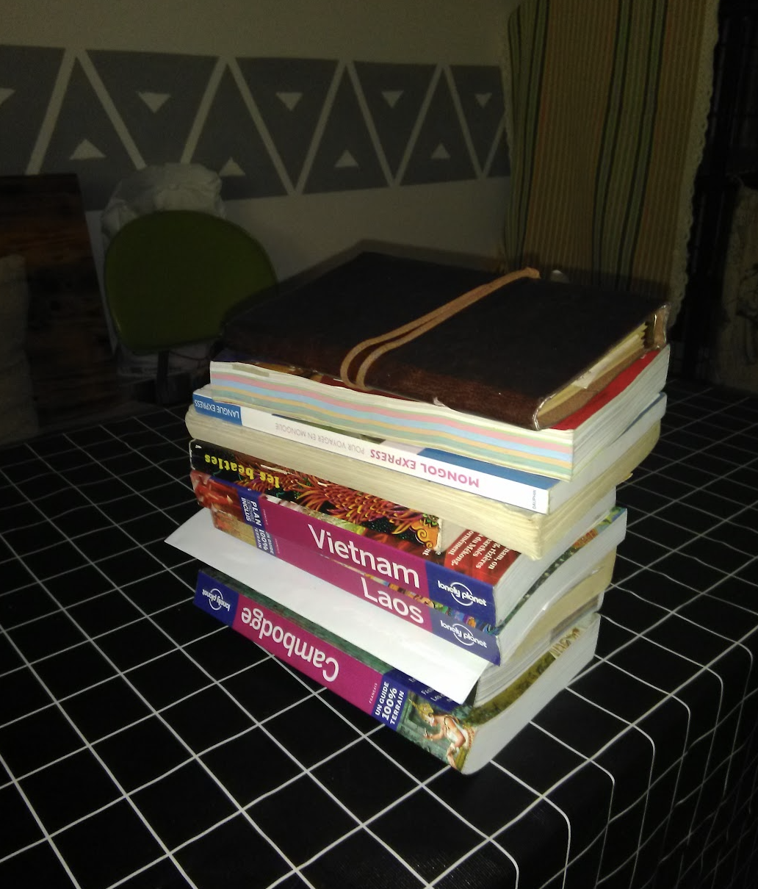

- 全世界年轻人最流行的，我们常说的“穷游”。欧美在70年代就开始流行了。
  
  许多旅行者甚至不需要手机，最长看的一本书是"lonely planet”，"孤独星球 ”
  
  里面包含了所有旅行需要的知识，类似我们手机中的美团，小红书，百度。
  
  搜索"背包客"，"packpacker” 会看到很多资讯。
  
  {:height 431, :width 248}
	- 之前遇到的法国朋友，英文不懂，甚至手机卡都不买全靠这些书环游世界。
	-
- [孤獨星球 - 維基百科，自由的百科全書](https://zh.wikipedia.org/wiki/%E5%AD%A4%E7%8D%A8%E6%98%9F%E7%90%83)
  [背包客 - 維基百科，自由的百科全書](https://zh.wikipedia.org/wiki/%E8%83%8C%E5%8C%85%E5%AE%A2)
-
-
-